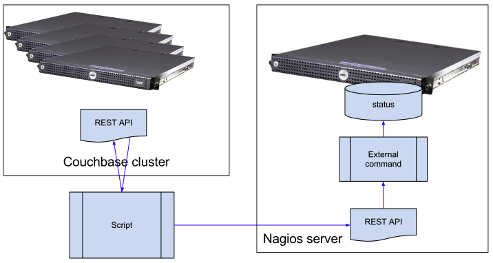

# @title System Design and Architecture


System architecture
----------------------

Diagram shows overview of the Nagios for Couchbase (NFC) design.


- NFC retrives data from Couchbase RESTful API
- Data processed internally by NFS
- RAG status information is submitted to Nagira RESTful API
- Nagira uses External Command interface to submit data to Nagios

Work-flow 
----------



- Configuration files `environment.yml` and `checks.yml` define application environment
- Nagira API is used to obtain list of Couchbase hosts - using Nagios hostgroup 
  - hostgroup is parameter configured in `environment.yml` file
  - hosts can be added to exclusion list in the same file
- Couchbase checks for Nagios configured in `checks.yml` file
- Each Couchbase host and each bucket queried for its status
- Results of the checks passed to Nagira API

For more details about configuration see {file:CONFIGURATION}

Directory layout
======================

Directory layout more or less reflects classes hierarchy. 

Submodules used:

- `lib/nagira` - Nagira API can be found on https://github.com/dmytro/nagira
- `nagios-ruby` - is fork of R.I.Pienaar project at https://github.com/ripienaar/ruby-nagios, with some additions.

````
├── bin
├── config
│   └── erb
├── documentation
│   └── images
└── lib
    ├── nagira
    │   ├── app
    │   │   └── routes
    │   │       ├── get
    │   │       └── put
    │   ├── config
    │   ├── docs
    │   ├── lib
    │   │   ├── nagira
    │   │   └── ruby-nagios
    │   │       ├── config
    │   │       └── nagios
    │   │           └── external_commands
    │   ├── spec
    │   └── test
    │       └── data
    │           └── bad
    └── wizcorp
        ├── couchbase
        └── nagios
            └── api
````

